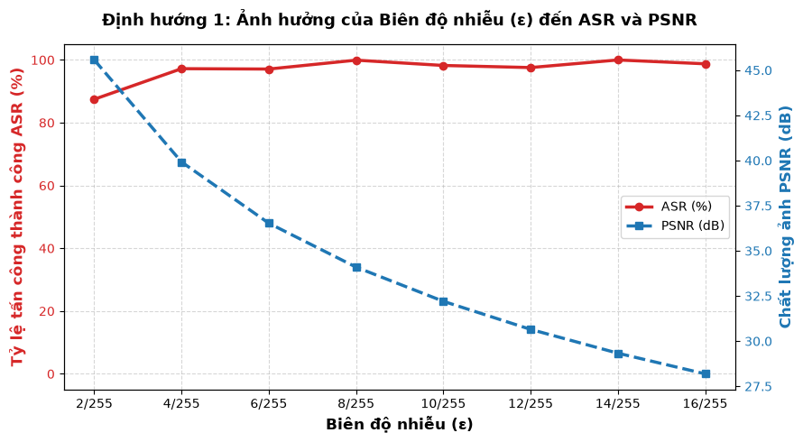
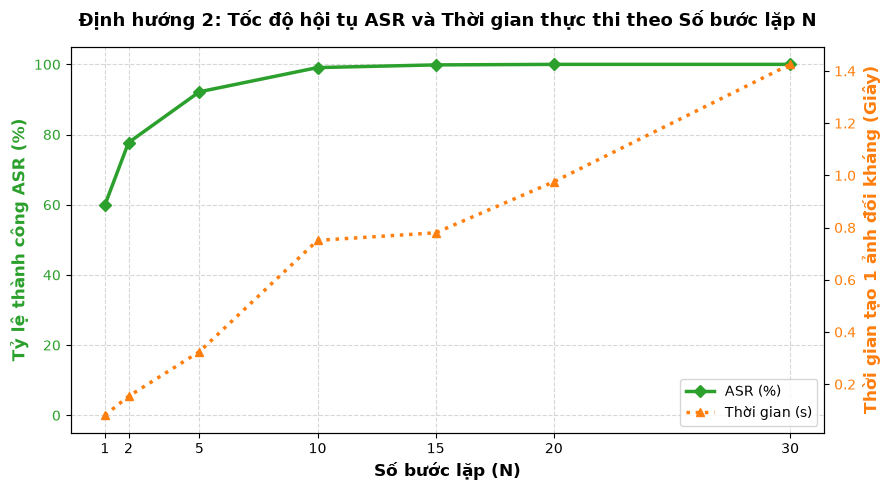
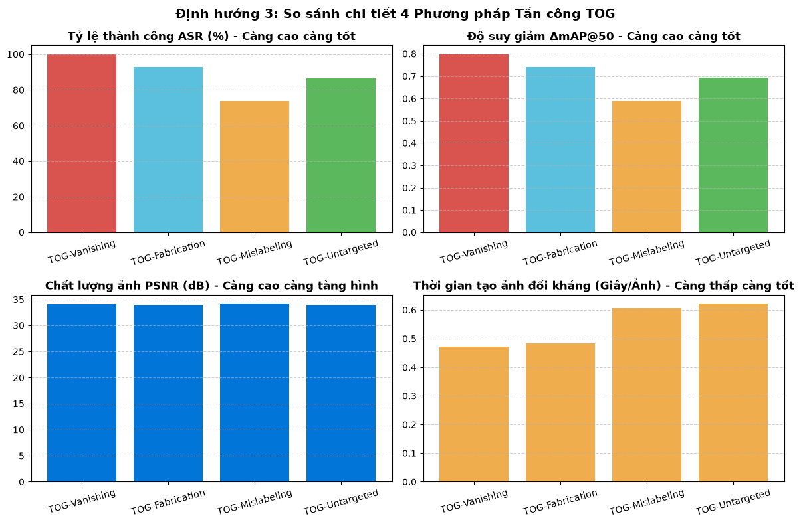
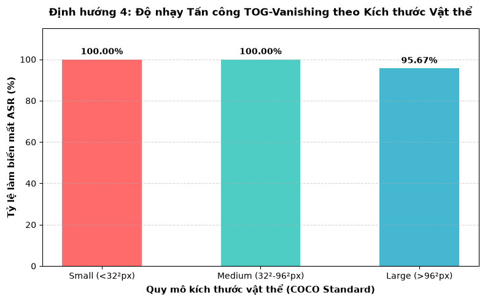

<div align="center">

# 🎯 YOLOv3 Adversarial Attack (TOG)


-76B900?style=for-the-badge&logo=nvidia)


**Team 1 — SEAS Summer Camp Project**  
*White-box Targeted Objectness Gradient (TOG) Attacks on YOLOv3 Object Detection*

---

</div>

## 📋 Table of Contents
- [📌 Overview](#-overview)
- [📂 Directory & Dataset Structure](#-directory--dataset-structure)
- [🚀 Quick Start & Environment Setup](#-quick-start--environment-setup)
- [💻 Headless Execution (CLI)](#-headless-execution-cli)
- [📊 Experimental Results & Metrics](#-experimental-results--metrics)
- [🔮 Limitations & Future Work](#-limitations--future-work)
- [👥 Team & Acknowledgments](#-team--acknowledgments)
- [📜 Citations & References](#-citations--references)

## 📌 Overview

This repository explores the adversarial vulnerabilities of **YOLOv3** under **Targeted Objectness Gradient (TOG)** attack strategies. By generating imperceptible, bounded perturbation patterns ($L_\infty$), we demonstrate how real-time object detection pipelines can be manipulated to cause missing detections, false positives, or misclassifications.
Find more about our presentation in [this video](https://youtu.be/dB-AoBHEkTk?si=xwMAu80q4DhGd_5L) and [this slide](https://canva.link/y4c3uole0mptke7)

## 📸 Visual Demonstration

Below is a side-by-side execution demo comparing raw YOLOv3 detections against the **TOG-Vanishing** adversarial attack on video input:

<p align="center">
  
</p>

### 🌟 Hardware & Benchmark System Specs
All benchmark experiments and metrics were executed on the following setup:
* **Machine**: ASUS TUF GAMING F16
* **CPU**: Intel Core i7-14650HX (2.20 GHz)
* **GPU**: NVIDIA GeForce RTX 5050 Laptop GPU (8 GB VRAM)
* **RAM**: 16.0 GB
* **Environment**: Windows 11 Home (25H2, Build 26200.9168) | **Python 3.12** | **CUDA 13.0**

---

## 📂 Directory & Dataset Structure

Organize your repository root directory as shown below before running training or attack scripts:

```text
YOLOv3-Adversarial-Attack/
├── data/                       
│   └── coco/                   # COCO root folder
│       ├── annotations/        # COCO annotation JSON files
│       └── val2017/            # MS COCO 2017 validation JPEG images
├── model/                      # YOLOv3 model configuration & weights
│   ├── class.names             # Class labeling file (80 COCO classes)
│   ├── yolov3                  # Darknet architecture configuration source (.cfg)
│   └── yolov3.weights          # Pre-trained Darknet weights (242,195 KB)
├── output_side_by_side.mp4     # Side-by-side demonstration output video
├── sample_video.mp4            # Sample test input video
├── main.ipynb                  # End-to-end execution & visualization notebook
├── tog_attacks.py              # Core TOG attack implementations & CLI interface
├── tog_model.py                # Gradient optimization loops & loss calculations
├── yolov3_model.py             # Darknet YOLOv3 wrapper & inference helper functions
├── utils.py                    # Pre/post-processing & visualization tools
├── environment.yml             # Conda environment definition (Python 3.12 / CUDA 13.0)
├── requirements.txt            # Python dependencies
└── README.md                   # Repository documentation

```

### 📥 Download Instructions

1. **MS COCO 2017 Validation Set**:
* Download: [COCO 2017 Val Images](https://drive.google.com/file/d/1VutbbQAgCn7__vfPy6qYtb0rLOIpc579/view?usp=sharing)
* Extract image files directly into `./data/coco/val2017/` and annotations into `./data/coco/annotations/`.


2. **YOLOv3 Weights & Config**:
* Download: [yolov3.weights](https://drive.google.com/file/d/1plerp95bu5GJjgXvMYTTMUUuSr33MwY0/view?usp=sharing)
* Place `yolov3.weights`, `yolov3` (config), and `class.names` into `./model/`.


---

## 🚀 Quick Start & Environment Setup

```bash
# Clone repository
git clone https://github.com/donglearning-pro/YOLOv3-Adversarial-Attack.git
cd YOLOv3-Adversarial-Attack

# Install dependencies
python -m pip install -r requirements.txt

```

---

## 💻 Headless Execution (CLI)

Run attacks directly from the command line without Jupyter notebooks:

```bash
# Execute TOG-Vanishing attack
python tog_attacks.py \
  --weights model/yolov3.weights \
  --config model/yolov3 \
  --class_names model/class.names \
  --data_dir data/coco/val2017 \
  --attack_type vanishing \
  --eps 0.031 \
  --steps 10 \
  --output_dir ./results

# Run minimal system test
python -m unittest test_smoke.py

```

---

## 📊 Experimental Results & Metrics

Below are some empirical findings evaluated across the sampled COCO 2017 validation dataset on the RTX 5050 GPU setup.

### 1. Perturbation Bound Amplitude ($\epsilon$) Analysis


The relationship between perturbation bound $\epsilon$ (scaled over 255), Attack Success Rate (ASR), and Peak Signal-to-Noise Ratio (PSNR):

| Epsilon ($\epsilon$) | ASR (%) | PSNR (dB) | Visual Impact |
| --- | --- | --- | --- |
| **2/255** | 87.5% | 45.5 dB | Completely imperceptible |
| **4/255** | 97.0% | 39.8 dB | Near-imperceptible |
| **6/255** | 97.0% | 36.2 dB | Low perceptual noise |
| **8/255** | 100.0% | 33.5 dB | Optimal trade-off point |
| **10/255** | 98.0% | 31.5 dB | Minor visible grain |
| **12/255** | 97.5% | 29.8 dB | Visible grain |
| **14/255** | 100.0% | 28.2 dB | Moderately noisy |
| **16/255** | 98.8% | 27.0 dB | High visible perturbation |

---

### 2. Convergence Speed & Iteration Latency ($N$)


Runtime performance and convergence rate across iteration steps ($N$):

| Iteration Steps ($N$) | ASR (%) | Runtime Latency (s/img) |
| --- | --- | --- |
| **1** | 60.0% | 0.12 s |
| **2** | 77.5% | 0.19 s |
| **5** | 92.0% | 0.38 s |
| **10** | **99.0%** | **0.75 s** |
| **15** | **100.0%** | **0.78 s** |
| **20** | 100.0% | 0.98 s |
| **30** | 100.0% | 1.42 s |

---

### 3. Comparison Across 4 TOG Attack Variants


| Attack Variant | Attack Success Rate (ASR) | $\Delta\text{mAP@50}$ Drop | Image Quality (PSNR) | Generation Time |
| --- | --- | --- | --- | --- |
| **TOG-Vanishing** | **100.0%** | **~0.80** | **34.1 dB** | **0.47 s/img** |
| **TOG-Fabrication** | **93.0%** | **~0.74** | **34.0 dB** | **0.48 s/img** |
| **TOG-Mislabeling** | **74.0%** | **~0.59** | **34.2 dB** | **0.61 s/img** |
| **TOG-Untargeted** | **86.5%** | **~0.69** | **34.0 dB** | **0.62 s/img** |

*TOG-Vanishing achieved the highest impact with complete bounding box suppression at 0.47s per image.*

---

### 4. Attack Sensitivity by Object Scale (COCO Standard)


Vulnerability comparison of object categories based on pixel bounding box area under **TOG-Vanishing**:

| Object Category | Bounding Box Pixel Area | ASR (%) | Vulnerability Level |
| --- | --- | --- | --- |
| **Small Objects** | $< 32^2\text{ px}$ | **100.00%** | Critical |
| **Medium Objects** | $32^2 \text{ to } 96^2\text{ px}$ | **100.00%** | Critical |
| **Large Objects** | $> 96^2\text{ px}$ | **95.67%** | High |

---

## 🔮 Limitations & Future Work

While this repository provides a complete white-box **Targeted Objectness Gradient (TOG)** attack baseline on YOLOv3, project timeline constraints left several threat models and architectures open for future exploration:

**⚠️ Current Limitations**
* **White-Box Scope**: Currently restricted to full-access gradient attacks where model architecture and weights are known.
* **Unexplored Threat Models**: 
  * *Grey-box / Transfer Attacks*: Generating perturbations on a surrogate model to attack unseen target models is not implemented.
  * *Black-box Attacks*: Query-based attack methods without access to gradients or weights were not explored.
* **Single Detector Focus**: Benchmarking is currently limited to YOLOv3.

---

**🚀 Future Roadmap & Next Steps**
* **Multi-Architecture Support**: Extend TOG attack variants across diverse detection paradigms:
  * **Modern One-Stage**: YOLOv5, YOLOv8, RetinaNet, CenterNet.
  * **Two-Stage Detectors**: Faster R-CNN, Mask R-CNN.
  * **Transformer-Based**: DETR and Deformable DETR.
* **Transferability & Black-Box Attacks**: Implement surrogate-model training to evaluate cross-architecture transferability and develop query-based black-box optimization loops.
* **Large-Scale Benchmarking**: Scale evaluations across the full MS COCO validation dataset while tracking comprehensive metrics ($\Delta\text{mAP@50}$, Target Success Rate, $L_p$ norms, SSIM, PSNR).
* **MLOps & QA Integration**: Integrate automated experiment logging (e.g., **Weights & Biases** or **TensorBoard**) and expand unit test coverage across core attack modules.

## 👥 Team & Acknowledgments

### 👥 Team 1 Members
* **Dương Phương Đông** *(Team Leader)*
* **Hoàng Bình Minh**
* **Trần Hoài Thương**
* **Dương Xuân Quân**
* **Lê Quang Huy**

### 👨‍🏫 Project Mentors
* **Nguyễn Tiết Khôi Nguyên**
* **Nguyễn Xuân Minh Đức**

---

### 🙏 Acknowledgments & Gratitude

We would like to express our sincere appreciation to everyone who supported this project:

* **SEAS Summer Camp (Summer in Engineering and Applied Sciences)**: For providing an exceptional platform, compute resources, and collaborative learning environment to explore adversarial machine learning.
(SEAS is a Vietnam non-profit program providing free learning opportunities for high school students and mentorship from graduate students and industry experts. It is occured at Đồng Hới, Quảng Bình annually. Find more about [this awesome summer camp](https://seas-cvn.com/))
* **Our Mentors (Nguyễn Tiết Khôi Nguyên & Nguyễn Xuân Minh Đức)**: For their dedicated guidance, invaluable technical feedback, and continuous encouragement throughout our research and implementation phase.
* **Our Teammates**: For the relentless dedication, technical contribution, and great teamwork that made this project possible.

---

## 📜 Citations & References

If you use this repository or build upon our work, please cite the following papers:

* **TOG Attack**: K.-H. Chow, L. Liu, S.-T. Liew, M. E. Gursoy, and S. Truex, "TOG: Targeted Adversarial Objectness Gradient Attacks on Real-time Object Detectors," *IEEE Transactions on Computers*, 2020.
* **YOLOv3**: J. Redmon and A. Farhadi, "YOLOv3: An Incremental Improvement," *arXiv preprint arXiv:1804.02767*, 2018.

---

## 📄 License

This project is licensed under the **MIT License** — see the [LICENSE](LICENSE) file for details.